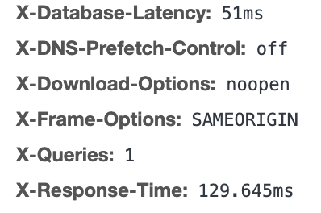

# sequelize-query-execution-time

Inspired by [expressjs/response-time](https://github.com/expressjs/response-time)

- profiling, benchmarking & logging

Steps:

Enable Benchmarking in sequelize options

```js
 new Sequelize('mysql://localhost', {
  dialect: 'mysql',
  timezone: '+05:30',
  benchmark: true,
  logging: false
 })
```

```js
const log = new Log(req, res);

const user = await User
  .create({ name: 'Naredra Modi' }, { logging: log.logging() });
```
      
You can see number of queries executed and response time in header


